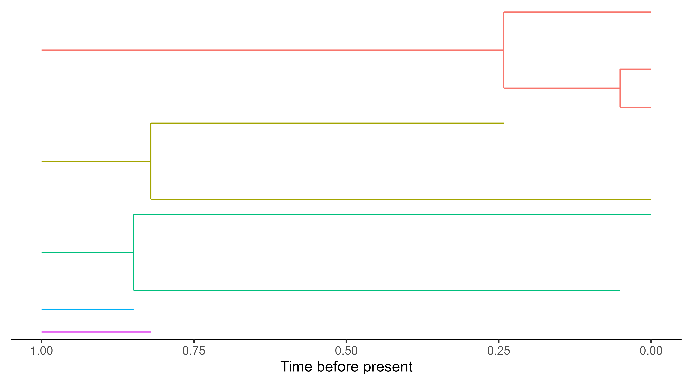
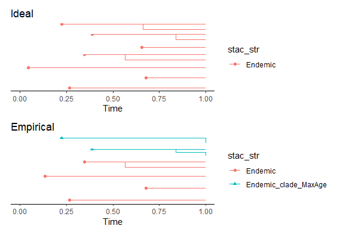
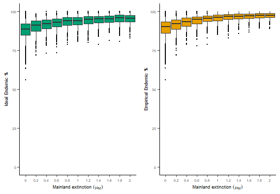

# Summary

Speciation and extinction of species are two of the most fundamental processes that are investigated in the field of evolutionary biology. Ideally, one would like to study these processes in replicated isolated systems. Islands comes close to this setting if colonisation is rare. However, often we cannot directly measure when an island was colonised, when a colonist species speciated, or when species went extinct. We can, however, use genetic data to reconstruct the evolutionary history of an island community. With this reconstructed data we can fit statistical models to understand macroevolutionary processes on islands. These models make simplifying assumptions in order for the fitting procedure to be tractable. One such assumption, made by, for example, the DAISIE model (from the `DAISIE` R package [@etienne_daisie_2022]), is that mainland species (i.e. the pool of species that can colonise the island) cannot diversify or go extinct. `DAISIEmainland` is an R package that simulates speciation and extinction on the mainland as well as colonisation and diversification on the island. Providing a more realistic model of the island and the mainland for evolutionary biology research, `DAISIEmainland` features include: (1) simulate the evolutionary history on island species, (2) visualise that history, (3) calculate and plot summary metrics of the simulated data. The package enables the simulation of phylogenetic datasets from islands under a model more representative of biological systems to test current inference models in island biogeography (e.g. DAISIE).

# Statement of Need

Analysis of phylogenetic data has provided many insights in evolutionary biology. Central to these advances is the R language [@r_core_team_r_2021] and the multitude of R packages which has facilitated the widespread utilisation of these methods [@paradis_analysis_2006]. Phylogenetic research in the domain of island biogeography was lacking until the development of the Dynamic Assembly of Island biota through Speciation, Immigration and Extinction (DAISIE) model provided several key findings for the macroevolution of island species [@valente_equilibrium_2015; @valente_simple_2020]. However, the performance and robustness of this island biogeography inference model is unknown when its assumptions are violated under biologically realistic scenarios. A central assumption of the DAISIE likelihood model is a static mainland pool of species that can colonise the island, i.e. simply a fixed number of mainland species that do not undergo speciation or extinction. `DAISIEmainland` relaxes this assumption by simulating phylogenetic data of island species which can be used to test whether a dynamic mainland species pool causes poor model estimation performance. The package allows for testing multiple scenarios that may be encountered by empiricists: mainland species go extinct before the present, mainland species are taxonomically known but not phylogenetically sampled, and mainland species are taxonomically undiscovered. The `DAISIEmainland` package has been applied to test the robustness of the DAISIE model [@lambert_effect_2022] (see `vignette(topic = "inference_performance", package = "DAISIEmainland")` for details). `DAISIEmainland` outputs data in the `DAISIE` format [@etienne_daisie_2022], for ease of application to the `DAISIE` R package, which provides a suite of phylogenetic likelihood inference models for island biogeography.

# Simulation and visualisation of the evolutionary history on islands

`DAISIEmainland` simulates events on both the mainland and island using the Doob-Gillespie algorithm, a stochastic continuous-time process [@gillespie_general_1976; @gillespie_exact_1977; @gillespie_stochastic_2007]. The mainland is simulated under a Moran process [@moran_random_1958], whereby every species extinction is immediately followed by a random species giving rise to two new species (speciation), so the number of species at any given time remains constant (figure 1).

Figure 1: Simulated evolutionary history for an example in which there are five mainland clades that form the mainland source pool of species that can colonise an island. The mainland clades are generated from a Moran process. Branching colour differentiates the mainland clades. The branching is symmetric, so when speciation occurs the original species dies and gives rise to two new species. This is different to the island branching and so is visualised differently.

The island Doob-Gillespie algorithm is run after the mainland algorithm and is altered to accommodate the dynamic mainland pool. The time-steps are bounded to not jump over changes on the mainland to ensure the present state of the system is always up-to-date regarding new species or extinct species on the mainland. The algorithm checks whether any changes have occurred on the mainland since the last time step and if so the system is updated and returned to the time at which the mainland last changed. This is valid owing to the Markov (memoryless) property of the Doob-Gillespie algorithm [@gillespie_general_1976; @gillespie_exact_1977; @gillespie_stochastic_2007].

Figure 2: Simulated island colonisation and diversification data. The *ideal* data is the complete knowledge data set, where every colonisation and branching time is known exactly, without error. The *empirical* data is the incomplete knowledge data set (emulating what empirical island biogeographers would usually have access to). The branch colours represent the endemicity status of the island species, whereby endemic species only occur on the island, and non-endemic species occur on the island and mainland. The branching is asymmetric, so when speciation occurs the original species survives and gives rise to one new species. 

For both the island and mainland the timing and type of events are sampled from an exponential distribution, based on the rates of all possible events. For the mainland process, mainland extinction rate ($\mu_M$) is the only parameter, whereas for the island there are rates of: cladogenesis ($\lambda^c$) (i.e. one island species bifurcating to form a new species on the island), island extinction ($\mu$), colonisation ($\gamma$), and anagenesis ($\lambda^a$) (i.e. an island species becoming different from its mainland ancestor). The Doob-Gillespie samples time steps and events until the time step exceeds the total time of the simulation. The simulated data is formatted and the endemicity of each island colonist is assigned which is used in the `DAISIE` inference model (for details of simulation algorithm see `vignette(topic = "simulation_algorithm", package = "DAISIEmainland")`). 

The `DAISIEmainland` simulation outputs two data sets: (1) contains full information of the colonisation times for all species(*ideal*), and (2) an incomplete information data set which resembles what an empirist would have access to (*empirical*). These two data sets allow for the quantification of error in estimation when the empiricist does not have access to all the data (Fig. 2).

`DAISIEmainland` can show the simulated island and mainland histories, such as displayed in figure 1 and figure 2 of this article (see `vignette(topic = "simulation_data_visualisation", package = "DAISIEmainland")`).

# Calculate and plot summary metrics of the simulated data

The package also outputs a number of summary metrics that are used to quantify the differences between the full information data set and the incomplete information data set simulated. These summary metrics include: the difference in normalised cumulative island colonisations through time ($\Delta$nCTT), percentage of island colonisations that appear to occur before the existence of the island due incomplete phylogenetic data, percentage of species on the island that are endemic and non-endemic. See `vignette(topic = "summary_metrics_visualisation", package = "DAISIEmainland")` for details.

Figure 3: Percentage of endemic species on the island across different values of mainland extinction rate. The boxplot contain 500 island replicates. The left hand panel is for the data set with complete information (*ideal*) and the right hand panel is for the data set with incomplete information (*empirical*).

# Acknowledgements

JWL was funded through a Study Abroad Studentship by the Leverhulme Trust and an NWO VICI grant awarded to Rampal S. Etienne.

# References
