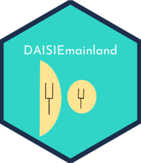

# DAISIEmainland 

<!-- badges: start -->
[](https://github.com/joshwlambert/DAISIEmainland/actions)
[](https://codecov.io/github/joshwlambert/DAISIEmainland/branch/main)
[](https://lifecycle.r-lib.org/articles/stages.html#stable)
[](https://www.repostatus.org/#active)
<!-- badges: end -->

The goal of DAISIEmainland is to simulate data to test whether the DAISIE model
(Dynamic Assembly of Island biota through Speciation Immigration and Extinction)
initially developed in Valente et al. (2015) and used in Valente et al. (2017a,
2017b, 2019, 2020) and Hauffe et al. (2020) can reliably estimate
macroevolutionary parameters (cladogenesis, extinction, carrying capacity,
immigration and anagenesis) when the assumption of a static mainland pool of
species is violated, as is the case in nature. 

## Installation

You can install the released version of DAISIEmainland from github with:

``` r
remotes::install_github("joshwlambert/DAISIEmainland")
```

The two non-CRAN dependecies required for DAISIEmainland are DAISIE and nLTT,
these can be install from github with:

``` r
remotes::install_github("rsetienne/DAISIE")
remotes::install_github("thijsjanzen/nLTT")
```

## Help

To report a bug please open an [issue](https://github.com/joshwlambert/DAISIEprep/issues/new) or email at j.w.l.lambert@rug.nl.

## Contribute

The DAISIE team always welcomes contributions to any of its packages. If you
would like to contribute to this package please follow the [contributing guidelines](https://github.com/joshwlambert/DAISIEmainland/tree/main/.github/CONTRIBUTING.md)

## Code of Conduct

Please note that the DAISIEmainland project is released with a [Contributor Code of Conduct](https://contributor-covenant.org/version/2/0/CODE_OF_CONDUCT.html). By contributing to this project, you agree to abide by its terms.

## Examples

See [examples](vignettes/examples.Rmd).

## Cite this package

``` r
citation("DAISIEmainland")
```


## Cite the DAISIE package

Etienne R. S., Valente, L., Phillimore, A. B., Haegeman, B., Lambert, J. W., Neves, P., Xie, S., & Bilderbeek, R. J. C. (2020). DAISIE: Dynamical Assembly of Islands by Speciation, Immigration and Extinction. R package version 3.0.1. https://cran.r-project.org/package=DAISIE

## References of previous DAISIE papers

Valente, L., Phillimore, A.B., & Etienne, R.S. (2015). Equilibrium and non-equilibrium dynamics simultaneously operate in the Galápagos islands. Ecology Letters, 18(8), 844–852. http://doi.org/10.1111/ele.12461

Valente, L., Etienne, R.S., & Dávalos, L.M. (2017). Recent extinctions disturb path to equilibrium diversity in Caribbean bats. Nature Ecology & Evolution, 1(2), 0026. http://doi.org/10.1038/s41559-016-0026

Valente, L., Illera, J.C., Havenstein, K., Pallien, T., Etienne, R.S., & Tiedemann, R. (2017). Equilibrium Bird Species Diversity in Atlantic Islands. Current Biology, 27(11), 1660-1666. https://doi.org/10.1016/j.cub.2017.04.053

Valente, L., Phillimore, A.B., & Etienne, R.S. (2018). Using molecular phylogenies in island biogeography: It’s about time. Ecography, 1–3. http://doi.org/10.1111/ecog.03503

Valente, L., Etienne, R.S., & Garcia-R., J.C. (2019). “Deep Macroevolutionary Impact of Humans on New Zealand’s Unique Avifauna.” Current Biology 29 (15): 2563-2569.e4. https://doi.org/10.1016/j.cub.2019.06.058

Valente, L., Phillimore, A.B., Melo, M., Warren, B.H., Clegg, S.M., Havenstein, K., Tiedemann, R., Illera, J.C.,, Thebaud, C., Aschenbach, T. & Etienne, R.S. (2020). “A Simple Dynamic Model Explains the Diversity of Island Birds Worldwide.” Nature 579 (7797): 92–96. https://doi.org/10.1038/s41586-020-2022-5

Hauffe, T., Delicado, D., Etienne, R.S., & Valente, L. (2020). Lake expansion elevates equilibrium diversity via increasing colonization. Journal of Biogeography 47: 1849–1860. https://doi.org/10.1111/jbi.13914

